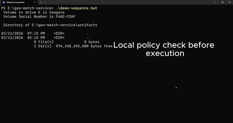

# Reflex Engine SDK

Use Reflex when you need to check a proposed action before execution and keep a replayable record of decision.

A telemetry event or proposed action goes in, Reflex evaluates it against local policy rules, returns ALLOW or DENY, and writes a JSON decision artifact for inspection, audit, and debugging.

**Purpose**: Pre-execution validation with deterministic behavior and replayable JSON decision artifacts. Not an autonomy stack.

For a complete walkthrough, see [GUIDE.md](GUIDE.md).

## Demo

[](docs/reflex-demo-fixed.mp4)

Local validation demo showing request evaluation, decision output, and artifact creation.

## Where this fits

Reflex sits between a planner, controller, or local system and execution. A proposed action comes in, Reflex checks it against rules, and writes a replayable JSON artifact before execution continues.

## Example use case

A robot, drone, or local controller proposes an action such as continuing a mission, entering a zone, or crossing a boundary. Reflex validates the action against local rules and records the decision for later inspection.

## What It Is

- A deterministic validation layer for telemetry and proposed actions
- A runtime action and policy guardrail with local execution
- A generator of replayable decision artifacts for inspection, audit, and debugging
- A small Rust project that is easy to run as a terminal demo or local API

## What It Is Not

- A full autonomy stack or flight control system
- A full fleet management platform
- A cloud observability suite
- A policy authoring console
- A claim of physical enforcement or autonomous control

## Architecture

Reflex implements a simple validation pipeline:

```
Event/Action → Policy Evaluation → ALLOW/DENY → JSON Artifact
```

### Core components

- **Policy Engine**: Loads JSON policy files with geofence and speed limit rules
- **Validator**: Deterministic spatial and telemetry evaluation logic  
- **Artifact Generator**: Creates tamper-evident JSON records for every decision
- **HTTP API**: Minimal REST interface for integration with local systems

### Where this fits technically

Reflex is intended as a subsystem within larger local or self-hosted stacks:

- **Robotics controllers**: Validate movement commands before execution
- **Mission planners**: Check proposed actions against operational constraints  
- **Local telemetry services**: Add validation layer to sensor data processing
- **Edge computing**: Provide deterministic decision making without cloud dependency

## What this demo proves

The current implementation demonstrates a complete validation loop with:

- **Policy loading**: JSON-based rule configuration with geofence and speed limits
- **Deterministic evaluation**: Consistent ALLOW/DENY decisions based on rule inputs
- **Artifact generation**: Replayable JSON records for every validation decision
- **Local HTTP API**: REST endpoint for integration with other systems
- **Container deployment**: Docker packaging for local service deployment

The demo processes two sample events:
1. An allowed event (within geofence, under speed limit)
2. A denied event (speed limit violation)

Both generate detailed JSON artifacts in `./artifacts/` showing the complete decision context.

### Technical capabilities demonstrated

- **Spatial validation**: Point-in-polygon geofence checking
- **Telemetry validation**: Speed limit enforcement
- **Rule composition**: Multiple rules evaluated per event
- **Decision persistence**: Structured JSON artifacts with full audit trail
- **Local service**: HTTP API for real-time validation requests

## What this demo does not prove

This implementation does not demonstrate:

- **Hard real-time guarantees**: No timing guarantees or schedulability analysis
- **Safety certification**: No formal verification or safety case
- **Production integration**: No hardware interfaces or actuator controls
- **Fleet management**: No multi-agent coordination or distributed systems
- **Cloud services**: No remote policy management or observability
- **Advanced rule types**: Limited to geofence and speed limit rules
- **Dynamic policy updates**: Policies are loaded at startup only

## Timing guarantees

This local HTTP/Docker demo does not establish hard real-time guarantees for the full wrapper path. It demonstrates deterministic policy evaluation at the rule layer. Lower-level target-specific kernel measurements may support stronger timing claims, but those results should be evaluated separately from this demo.

## Quick Start

**Terminal demo**:
```bash
# Windows (one-click)
run-demo.bat

# Cross-platform manual
cargo build --release --bin demo
./target/release/demo.exe  # Windows
./target/release/demo      # macOS/Linux
```

**API server**:
```bash
cargo run --bin server
# Server listens on http://127.0.0.1:18080
# POST /validate endpoint available
```

**Docker**:
```bash
docker build -t reflex-server:local .
docker run --rm -p 18080:18080 -v "%cd%\artifacts:/app/artifacts" reflex-server:local
```

## API Usage

```bash
curl.exe -X POST http://127.0.0.1:18080/validate \
  -H "Content-Type: application/json" \
  --data @safe-event.json
```

Response format:
```json
{
  "decision": "allow",
  "reason": "geofence_001 ok, speed_002 ok", 
  "policy_id": "spatial-guard-001",
  "artifact_version": "1.0"
}
```

## Decision Artifacts

Every validation generates a JSON artifact containing:

```json
{
  "timestamp": 1772941348,
  "action_id": "evt-001", 
  "decision": "ALLOW",
  "reason": [
    "Geofence geofence_001: PASS - Inside Sacramento Area",
    "Speed speed_002: PASS - 0.8 m/s <= 2.0 m/s"
  ],
  "policy_id": "spatial-guard-001",
  "input_payload": { /* complete event data */ },
  "artifact_version": "1.0"
}
```

Artifacts provide a replayable decision record for debugging and analysis.

## Performance Notes

Preliminary benchmark notes for lower-level validation codepaths are available in [BENCHMARKS.md](./BENCHMARKS.md). These measurements are environment-specific and separate from the local HTTP/Docker demo path.

## Repository Structure

- `src/model.rs` - Domain types for policies, events, and decisions
- `src/validator.rs` - Core validation logic and rule evaluation
- `src/artifact.rs` - Artifact schema and JSON persistence  
- `src/bin/demo.rs` - Terminal demo implementation
- `src/bin/server.rs` - HTTP API server
- `demo-policy.json` - Sample policy configuration
- `safe-event.json` / `violating-event.json` - Test event payloads

## Future Work

Potential extensions beyond the current demo:

- **Additional rule types**: Altitude limits, proximity rules, time-based constraints
- **Policy hot-reload**: Runtime policy updates without service restart
- **Performance optimization**: Batch processing, caching, parallel evaluation
- **Advanced logging**: Structured logging with configurable verbosity
- **Integration examples**: Sample adapters for common robotics frameworks
- **Testing framework**: Property-based tests for validation correctness

## License

This project is provided as a reference implementation for local validation patterns.

